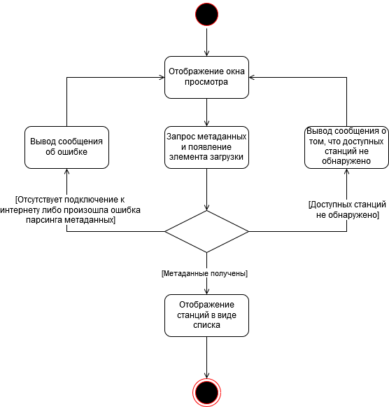

## Содержание
1. [Просмотр списка доступных станций](#1)
2. [Поиск нужной станции](#2)
3. [Прослушивание желаемой станции](#3)
4. [Приостановка/продолжение воспроизведения](#4)
5. [Сохранение и запись аудио](#5)

### 1. Просмотр списка доступных станций 
При входе в приложение делается запрос на метаданные доступных станций без каких-либо критериев. При удачной обработке запроса сперва отображаюся первые 30 станций, далее по мере прокрутки ползунка подгружаются остальные станции.

### 2. Поиск нужной станции
После нажатия кнопки поиска, пользователь видит окно поиска рецептов. После ввода названия и нажатия кнопки "Search", приложение отправляет запрос на получение списка рецептов. Если список рецептов получен, то приложение отображает его, если возникли ошибки, то приложение сообщает об этом.

  
### 3. Прослушивание желаемой станции
При входе в приложение отображаются сохраненные рецепты пользователя.

### 4. Приостановка/продолжение воспроизведения
При нажатии кнопки создания нового рецепта, пользователь видит окно создания рецепта. После ввода данных и нажатия кнопки сохранения, рецепт сохраняется в базу данных. Если возникли ошибки, то приложение сообщает об этом.

### 5. Сохранение и запись аудио
После нажатия кнопки поиска, пользователь видит окно поиска рецептов. После ввода названия и нажатия кнопки "Search", приложение отправляет запрос на получение списка рецептов. Если список рецептов получен, то приложение отображает его, если возникли ошибки, то приложение сообщает об этом.

