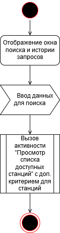

## Содержание
1. [Просмотреть список доступных станций](#1)
2. [Найти нужную станцию](#2)
3. [Слушать желаемую станцию<](#3)
4. [Приостановить/продолжить воспроизведение](#4)
5. [Сохранить и записать аудио](#5)

### 1. Просмотреть список доступных станций 
При входе в приложение делается запрос на метаданные доступных станций без каких-либо критериев. При удачной обработке запроса сперва отображаюся первые 30 станций, далее по мере прокрутки ползунка подгружаются остальные станции. При возникновении ошибки приложение покажет соответствующее сообщение.

### 2. Найти нужную станцию 
После нажатия кнопки поиска приложение затемняет основной экран и открывает окно поиска. Затем пользователь вводит информацию для поиска и приложение формирует и посылает соответствующий запрос. Далее приложение функционирует как в предыдущем пункте.

  
### 3. Слушать желаемую станцию
При нажатии на иконку нужной станции приложение формирует и посылает запрос на сервер. При его удачной обработке в приложение возвращаются необходимые данные и аудио-поток начинает вопроизводиться. При возникновении ошибки приложение покажет соответствующее сообщение. 

### 4. Приостановить/продолжить воспроизведение
При нажатии кнопки "Старт/Пауза" приложение делает соответствующий запрос, при этом меняя состояние кнопки. При возникновении ошибки приложение покажет соответствующее сообщение.

### 5. Сохранить и записать аудио
После нажатия пользователем кнопки записи приложение посылает соответствующий запрос и начинает запись аудио-потока. Затем, когда пользователь нажимает кнопку "Остановка записи", приложение внось делает запрос и сохраняет полученных файл в память устройства. При возникновении ошибки на каком-либо из этапов приложение покажет соответствующее сообщение.

