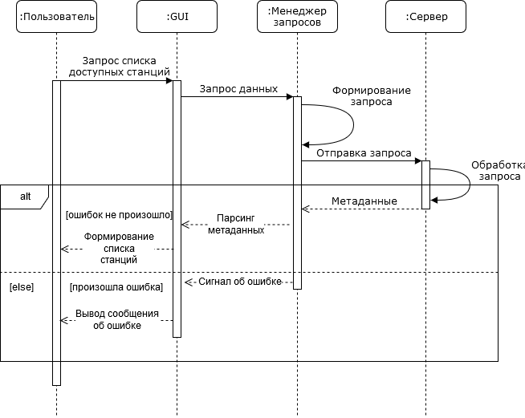
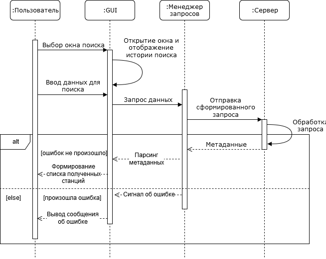
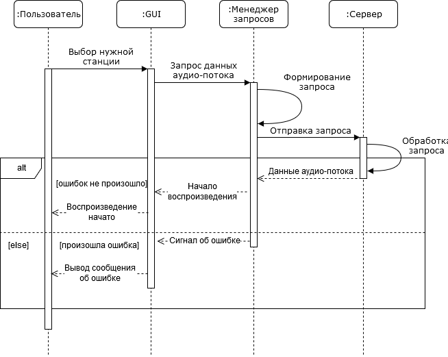
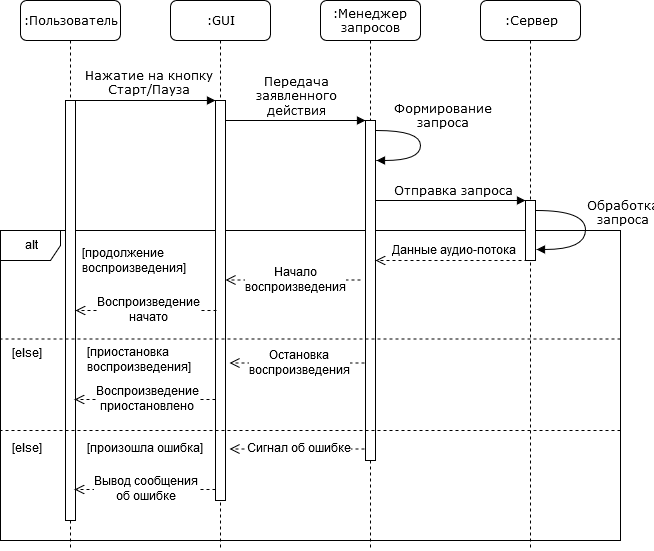
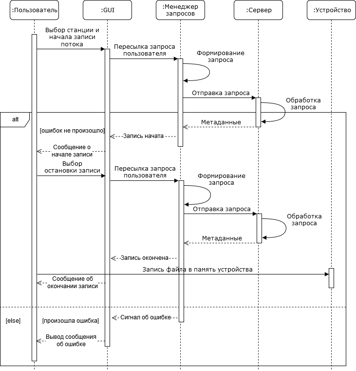

## Содержание
1. [Просмотр списка доступных станций](#1)
2. [Поиск нужной станции](#2)
3. [Прослушивание желаемой станции](#3)
4. [Приостановка/продолжение воспроизведения](#4)
5. [Сохранение и запись аудио](#5)

### 1. Просмотр списка доступных станций 

### 2. Поиск нужной станции 

  
### 3. Прослушивание желаемой станции

### 4. Приостановка/продолжение воспроизведения

### 5. Сохранение и запись аудио

