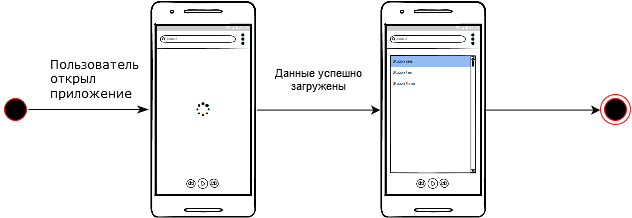
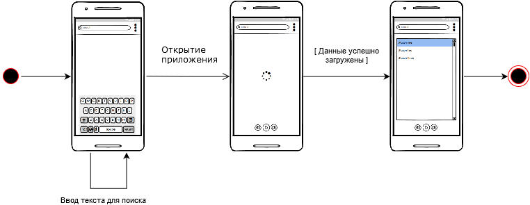
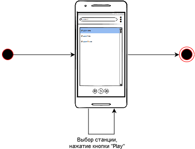
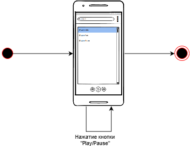
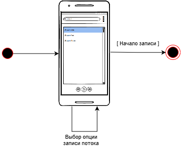

## Содержание
1. [Просмотреть список доступных станций](#1)
2. [Найти нужную станцию](#2)
3. [Слушать желаемую станцию<](#3)
4. [Приостановить/продолжить воспроизведение](#4)
5. [Сохранить и записать аудио](#5)

### 1. Просмотреть список доступных станций 

### 2. Найти нужную станцию 

  
### 3. Слушать желаемую станцию 

### 4. Приостановить/продолжить воспроизведение

### 5. Сохранить и записать аудио

