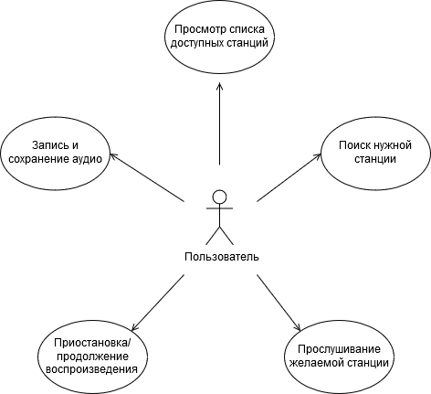

# Диаграмма вариантов использования

Каждый вариант использования подробно описан в [потоке событий](../UseCases/FlowOfEvents.md).

Ключевые понятия, используемые в диаграмме, отражены в [глоссарии](../UseCases/Glossary.md). 
