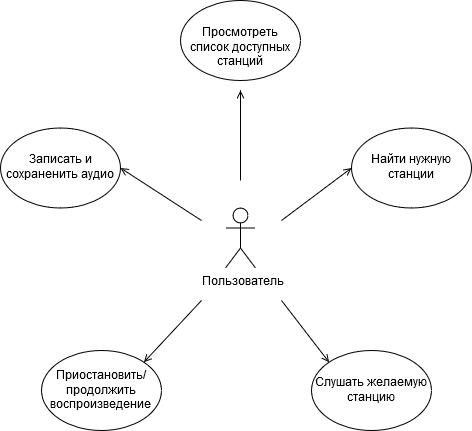

# Диаграмма вариантов использования

Каждый вариант использования подробно описан в [потоке событий](../UseCase/FlowOfEvents.md).

Ключевые понятия, используемые в диаграмме, отражены в [глоссарии](../UseCase/Glossary.md). 
